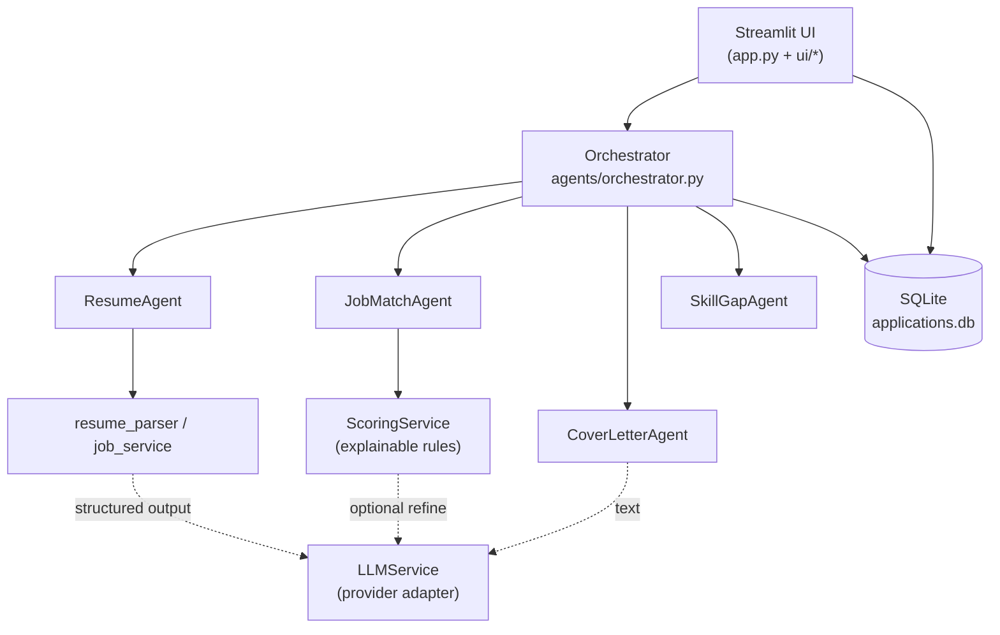

# 🤖 Agentic AI Job Application Assistant

An AI-powered job-application assistant for students and early-career engineers. It analyses a
resume, structures a job description, computes an **explainable** match score, generates an honest
cover letter, builds a prioritised skill-gap learning plan, and tracks every application in a local
SQLite database.

Built with **Python 3.12**, **Streamlit**, **LangChain**, **Pydantic**, **pypdf**, **python-docx**
and **SQLite**. Designed to run end-to-end **even without an API key** thanks to a deterministic,
rule-based fallback engine — which also makes it fully unit-testable offline.

---

## ✨ Features

| # | Feature | What it does |
|---|---------|--------------|
| 1 | **Resume Analyzer** | Upload PDF/DOCX/TXT, extract education, skills, experience, projects & certifications; review and correct every field. |
| 2 | **Job Description Analyzer** | Paste a JD; extract required/preferred skills, responsibilities, qualifications and experience. |
| 3 | **Intelligent Job Matching** | Explainable match score with matched / partial / missing / unsupported skills and a full score breakdown. |
| 4 | **Cover Letter Generator** | Personalised, resume-grounded draft — no invented achievements or company facts. Download or copy. |
| 5 | **Skill Gap Analyzer** | Prioritised learning plan with reasons, exercises and project suggestions, separating required from optional. |
| 6 | **Resume Improvement** | Side-by-side original vs. suggested bullet points — never inventing metrics. |
| 7 | **Application Tracker** | Full CRUD, search, statuses (Interested → Preparing → Applied → Interview → Offer → Rejected), stats. |
| 8 | **Agentic Workflow** | Specialised agents coordinated by an orchestrator with validation, retries and confirmation gating. |
| 9 | **Modern UI** | Cards, tables, progress bars, status badges, clear error messages. |
| 10 | **Security & Privacy** | Env-based credentials, upload validation, no secret/secret logging, git-ignored private data. |

> **Honesty note:** the match score is a transparent *similarity index* built from keyword and rule
> overlap. It is **not** a prediction of hiring probability and does not represent any employer's
> decision process.

---

## 🏗️ Architecture



**Layering rule:** `ui → agents → services → (config | database | utils)`. The UI never talks to
SQLite or an LLM directly; only the orchestrator coordinates agents.

```
agentic-ai-job-assistant/
├── app.py                     # Streamlit entry point + navigation
├── requirements.txt           # Pinned dependencies
├── .env.example               # Placeholder credentials only
├── .gitignore                 # Excludes .env, venv, uploads, *.db
├── README.md
├── config/
│   ├── settings.py            # Env-driven config, paths, limits, scoring weights
│   └── skills_lexicon.py      # Curated skill aliases for the offline engine
├── agents/
│   ├── resume_agent.py        # Extraction + bullet-improvement suggestions
│   ├── job_match_agent.py     # Explainable matching wrapper
│   ├── cover_letter_agent.py  # LLM or deterministic cover letter
│   ├── skill_gap_agent.py     # Prioritised learning plan
│   └── orchestrator.py        # Coordinates agents, validates, gates actions
├── services/
│   ├── resume_parser.py       # PDF/DOCX/TXT -> ResumeData
│   ├── llm_service.py         # Provider adapter: retries, JSON validation, fallback
│   ├── job_service.py         # JD -> JobRequirements
│   └── scoring_service.py     # Weights, classification, score breakdown
├── database/
│   ├── db.py                  # Connection + auto schema init
│   ├── models.py              # Pydantic models (all structured payloads)
│   └── repository.py          # CRUD + dashboard aggregates
├── prompts/
│   ├── resume_prompt.txt
│   ├── match_prompt.txt
│   └── cover_letter_prompt.txt
├── ui/
│   ├── dashboard.py
│   ├── resume_page.py
│   ├── jobs_page.py
│   ├── assistant_page.py      # Cover letter + skill gap
│   ├── tracker_page.py
│   └── style.py               # Badges, score colouring
├── utils/
│   ├── validators.py          # Extension/size/email/regex guards
│   └── file_handler.py        # Safe upload persistence (metadata-only logging)
├── tests/
│   ├── conftest.py            # Fixtures incl. a mock LLM client
│   ├── test_parser.py
│   ├── test_scoring.py
│   ├── test_agents.py
│   ├── test_database.py
│   └── fixtures/
│       └── generate_fixtures.py
└── data/
    └── .gitkeep               # applications.db + uploads/ live here (git-ignored)
```

---

## ✅ Prerequisites

- **Python 3.12** (`python --version`)
- **pip** and **venv**
- (Optional) An OpenAI API key for richer AI text — the app works without one.

Check in **Windows PowerShell**:

```powershell
python --version
python -m venv --help
```

---

## 🚀 Installation (Windows PowerShell + VS Code)

```powershell
# 1. Create and open the project folder
mkdir agentic-ai-job-assistant
cd agentic-ai-job-assistant

# 2. Create and activate a virtual environment
python -m venv .venv
.\.venv\Scripts\Activate.ps1

# If activation is blocked, allow it for this session only:
# Set-ExecutionPolicy -Scope Process -ExecutionPolicy Bypass

# 3. Install dependencies
python -m pip install --upgrade pip
pip install -r requirements.txt

# 4. Create your environment file from the template
Copy-Item .env.example .env
```

Edit `.env` in VS Code. To use AI features, set your key; otherwise leave it blank and the app runs
in deterministic mode.

```dotenv
LLM_PROVIDER=openai
LLM_MODEL=gpt-4o-mini
OPENAI_API_KEY=sk-your-key-here
```

---

## ▶️ Running the app

```powershell
.\.venv\Scripts\Activate.ps1
streamlit run app.py
```

Open **http://localhost:8501** in your browser. The SQLite database is created automatically on
first launch.

---

## 🧪 Running the tests

All tests run **offline** — the LLM is mocked, so no API credits are used.

```powershell
.\.venv\Scripts\Activate.ps1
pytest -q
pytest -v                       # verbose
pytest tests/test_scoring.py    # a single file
pytest --cov=. --cov-report=term-missing   # with coverage (pip install pytest-cov)
```

Generate synthetic resume fixtures (fictional data only):

```powershell
python tests\fixtures\generate_fixtures.py
```

---

## 🎬 Sample demonstration workflow

1. **Dashboard** — see the empty pipeline and the engine badge ("Deterministic mode").
2. **Resume Analyzer** — upload `tests/fixtures/sample_resume.pdf` (or `.docx`), click
   **Analyse resume**, then correct any field and **Save corrections**. Open *Resume improvements*
   to see original vs. suggested bullets.
3. **Job Matcher** — paste the text from `tests/fixtures/sample_job.txt`, click **Analyze job** then
   **Full pipeline**. You'll see the match score, the 5-part breakdown, and the four
   skill categories with reasons. Scroll down and **Save application** (tick the confirm box).
4. **Cover Letter & Skill Gap** — generate the letter (download as `.txt`) and the learning plan
   (required gaps first).
5. **Application Tracker** — edit the saved record, move it to **Applied**, search for it, and view
   the statistics tab.

**Expected output (deterministic mode):** a match score in the ~50–90 % range, several
**Matched** skills (Python, SQL, Git), **Partial** items (Docker via related skills), **Missing**
items (Kubernetes, Machine Learning), and the disclaimer shown with every score.

---

## 🔐 Security & privacy

- Credentials come **only** from environment variables; `.env` is git-ignored.
- `.env.example` contains **placeholders only** — never a real key.
- Uploads are validated (`pdf/docx/txt`, ≤ 5 MB) and stored in `data/uploads/` (git-ignored).
- **No resume contents or secrets are ever logged** — only file metadata and error types.
- Resume text is sent to a model **only** when an API key is configured. Without a key, everything
  stays local.
- **Nothing is ever sent or submitted automatically.** Saving records and any external-style action
  require an explicit confirmation checkbox.
- **Where data lives:** records → `data/applications.db`; uploads → `data/uploads/`. Delete those to
  wipe all local data.

---

## 🛠️ Troubleshooting

| Symptom | Fix |
|---------|-----|
| `Activate.ps1 cannot be loaded` | `Set-ExecutionPolicy -Scope Process -ExecutionPolicy Bypass` |
| `No module named streamlit` | Activate the venv, then `pip install -r requirements.txt` |
| `No extractable text found` | Your PDF is a scan. Upload a text-based PDF, a DOCX, or paste text. |
| App says "Deterministic mode" | No `OPENAI_API_KEY` in `.env`. Add it and restart Streamlit. |
| `LLM call failed after retries` | Check the key, billing/quota, and `OPENAI_BASE_URL`. The app auto-falls back. |
| Port 8501 in use | `streamlit run app.py --server.port 8502` |
| Match score looks low | Improve the skills section of your resume, or check the parsed JD skills. |
| Tests fail on import | Run `pytest` from the project root (the root is added to `sys.path` by `conftest.py`). |

---

## 🚧 Future enhancements

- Embedding-based semantic matching (vector similarity) alongside the rule engine.
- Multi-resume versioning and side-by-side comparison.
- Job-board integrations with user-confirmed auto-fill.
- Export the tracker to Excel/CSV and the cover letter to PDF.
- Interview-question generation grounded in the JD.
- Authentication and encrypted, per-user storage.

---

## 📄 License

Released for educational and portfolio use.
